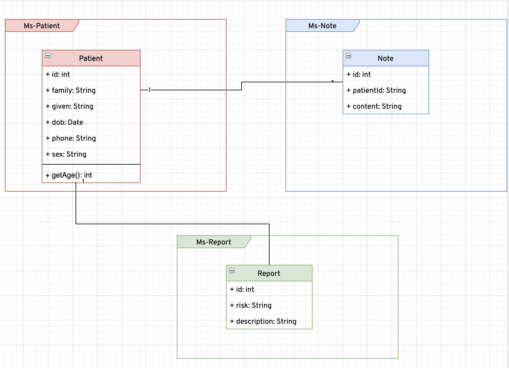

# Mediscreen Application

This is a Java / Maven / Spring Boot application which provides RESTful services.

## Project description
### Class Diagram

### Architecture

## Installation Instructions
  You can import the project as a maven application to your favorite IDE. I made my tests by using intellij.
  If lombok gets in your way, by referring [this answer](https://stackoverflow.com/a/22332248/4130569), you can install lombok by its jar file.

### Requirement package
1. Java 11
2. Spring Boot
3. Mysql *(Optional If you don't want to use docker)
4. MongoDb *(Optional If you don't want to use docker)
3. Docker  *(Optional If you don't want to use docker)
4. Docker-Compose *(Optional If you don't want to use docker)

### To run the application
Use one of the several ways of running a Spring Boot application. Below are just three options:
1. Build using maven goal (or by using maven wrapper): `mvn clean package` and execute the resulting artifact as follows `java -jar {MicroServiceName}-0.0.1-SNAPSHOT.jar` or
2. On Unix/Linux based systems: run `mvn clean package` then run the resulting jar as any other executable `./MicroServiceName-0.0.1-SNAPSHOT.jar`
3. Run as a [Docker](https://www.docker.com/) container. (What's most recommended)  
    1) Clone the repository.
    2) cd to project root directory.
    3) Run this cmd `cd ms-note && ./mvnw clean package && cd ../ms-patient && ./mvnw clean package && cd ../ms-report && ./mvnw clean package && ../ui && ./mvnw clean package && cd ..`
    4) Run `docker-compose up -d --build`
      * If you get a `./mvnw not found` error, just run `mvn -N io.takari:maven:wrapper -Dmaven=3.5.3` while in the root directory of the project.

## To test the application
  1. Go inside on `http://localhost:8004`
  2. Get list of patients with /patient/list url.
  
    `$ curl --location --request GET 'http://localhost:8002/patient/list'`
  You'll get a response as in below.
  
    `[
         {
             "id": 1,
             "family": "Kone",
             "given": "Ben Fousseni Christ",
             "dob": "1975-01-01",
             "sex": "M",
             "address": "Abidjan",
             "phone": "+4477059870",
             "age": 46
         },
         {
             "id": 2,
             "family": "Lia",
             "given": "Sepri Samuella",
             "dob": "1975-01-02",
             "sex": "F",
             "address": "Abidjan",
             "phone": "+4477059870",
             "age": 46
         }
     ]`
  3. Add a new patient with /patient/add url.
  
 
    ` $ curl --location --request POST 'http://localhost:8002/patient/add' \
     --header 'Content-Type: application/json' \
     --data-raw '{
         "family": "Kone",
         "given": "Ben Fousseni christ",
         "dob": "1996-06-28",
         "sex": "M",
         "address": "Abidjan BP 18",
         "phone": "+22(0è77059870"
     }'`
  
   You'll get a response as in below.
  
    `{
       "id": 3,
       "family": "Kone",
       "given": "Ben Fousseni christ",
       "dob": "1996-06-28",
       "sex": "M",
       "address": "Abidjan BP 18",
       "phone": "+22(0è77059870",
       "age": 0
   }`
  
  4. Add new note with /note/list.

    `$ curl --location --request POST 'http://localhost:8002/patient/add' \
     --header 'Content-Type: application/json' \
     --data-raw '{
         "family": "Kone",
         "given": "Ben Fousseni christ",
         "dob": "1996-06-28",
         "sex": "M",
         "address": "Abidjan BP 18",
         "phone": "+22(0è77059870"
     }'`
     
  You'll get a response as in below
        
    `[
         {
             "id": 1,
             "patient": {
                 "id": 2,
                 "family": "Lia",
                 "given": "Sepri Samuella",
                 "dob": "1975-01-02T00:00:00.000+00:00",
                 "sex": "F",
                 "address": "Abidjan",
                 "phone": "+4477059870",
                 "age": 46
             },
             "content": "She has not pain"
         },
         {
             "id": 2,
             "patient": {
                 "id": 1,
                 "family": "Kone",
                 "given": "Ben Fousseni Christ",
                 "dob": "1975-01-01T00:00:00.000+00:00",
                 "sex": "M",
                 "address": "Abidjan",
                 "phone": "+4477059870",
                 "age": 46
             },
             "content": "He's nothing"
         }
     ]`
